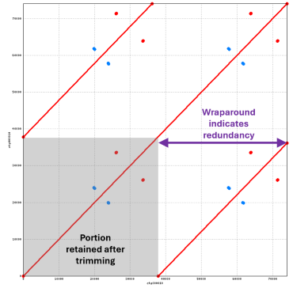

# Remove terminal redundancy from over-circularized contigs

## Requirements

Before running this step, you need to have generated multiple independent assemblies of the genome of interest, saved each contig of each assembly as a separate .fasta file, and then used nucmer to perform self-alignments of each contig (as done [here](ONT_5assemblers_nucmer.md)).

### Software needed
* text editor (e.g., GNU nano)
* bedtools (https://bedtools.readthedocs.io/en/latest/) 
</br>

## General notes

The procedure outlined below must be performed for **_each_** contig for **_each_** assembly.

*The steps below assume that the assemblies were generated on a remote machine/HPC. Transfer to a local machine may not be necessary.*  
</br>

## Procedure
**Step 1:** Copy all nucmer graphs for each assembly for each genome into a single directory, then export to a local machine.  
</br>

**Step 2:** Using local machine, visualize each .png dotplot to indentify over-circularized contigs.  

_This is an example of a dot plot indicating terminal redundancy (purple arrows). The shaded box indicates the region that will remain after trimming the contig._


**Step 3:** Look at the corresponding .coords file for each over-circularized contig to determine at what coordinate the contig should be trimmed at the 3' end to eliminate the terminal redundancy.  
</br>

**Step 4:** Use GNU nano (or another text editor) to generate a .bed file listing the coordinates that should be kept for each contig in a given assembly. 

_Some notes:_
* The .bed file will be applied to the original multi-fasta output from the assembler, so it must include **_ALL_** contigs for that assembly, including those that do not need to be trimmed.
* Trimming is only done at the 3' end of the contig, so the start coordinate will remain 1 for all contigs.
* .bed file columns can be separated by spaces or tabs.
* The contig names _**must match**_ those in the original multi-fasta file for that assembly.

**.bed file format:** 
```
contig_name     1     end_coordinate
contig_name     1     end_coordinate
contig_name     1     end_coordinate
etc... 
```  
</br>

**Step 5:** On the machine where assembly was performed, use bedtools to trim the original multi-fasta file to keep only those coordinates sepcified in the .bed file.

*The new trimmed assembly is given a new name and the original untrimmed assembly is preserved.*

```
bedtools getfasta -fi /<fullpath>/<original_assembly_name>.fasta -fo /<fullpath>/<trimmed_name>.fasta -bed /<fullpath>/<file_name>.bed 
```


