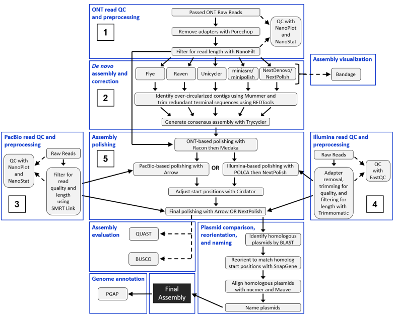

# Complete Genome Sequences of Four Strains of *Erwinia tracheiphila*: A Resource for Studying a Bacterial Plant Pathogen with a Highly Complex Genome
**Publication details:** LaSarre B, Olawole OI, Paulsen AA, Halverson LJ, Gleason ML, Beattie GA. Complete Genome Sequences of Four Strains of *Erwinia tracheiphila*: A Resource for Studying a Bacterial Plant Pathogen with a Highly Complex Genome. _Mol Plant Microbe Interact._ 2022 Jun;35(6):500-504. doi: 10.1094/MPMI-01-22-0008-A. Epub 2022 May 1. PMID: 35491948.

## Abstract
*Erwinia tracheiphila*, the causative agent of bacterial wilt of cucurbits, has a highly complex genome harboring an abundance of repetitive elements and prophage. Here, we present the closed genome sequences of *E. tracheiphila* strains BHKY, BuffGH, MDCuke, and SCR3, which belong to two phylogenetic clades that differ in host-specific virulence. These are the first complete genome assemblies of this plant pathogen.

## Content
 The files in this repository detail the pipeline for using Nanopore ultra-long read sequencing in combination with PacBio long-read or Illumina short-read sequencing to assemble complete, closed genomes for *Erwinia tracheiphila*.

### Flow chart illustrating overall assembly pipeline
The files provided below provide details for all steps in boxes 1–5.

## Read QC and preprocessing (Steps 1, 3, and 4)

[ONT_preQC](Files\01_ReadQC\ONT_preQC.md) - Text file describing Nanopore read pre-processing and QC

[PacBio_preQC](Files\01_ReadQC\PacBio_preQC.md) - Text file describing PacBio read pre-processing and QC

[Illumina_preQC](Files\01_ReadQC\Illumina_preQC.md) - Text file describing Illumina read pre-processing and QC  
 

## Assembly (Step 2)

[ONT_5assemblers_nucmer](Files\02_Assembly\ONT_5assemblers_nucmer.md) - Text file describing the steps and commands for *de novo* assembly of pre-processed Nanopore reads using five different assemblers and self-alignment of contigs to evaluate over-circularization.

[Remove_terminal_redundancy](Files\02_Assembly\Remove_terminal_redundancy.md) - Text file describing the steps and commands for identifying over-circularized contigs and trimming the multi-fasta file for each assembly to eliminate terminal redundancy.

[Trycycler_reconciliation](Files\02_Assembly\Trycycler_reconciliation.md) - Text file describing the steps for creating a consensus genome assembly using Trycyler (must be done manually for each genome because there is an occasional need for manual intervention).  
 

## Assembly Polishing (Step 5)
[Polishing_ONTplusIllumina](Files\03_Polishing\Polishing_ONTplusIllumina.md) - Text file describing the steps and commands for polishing assemblies with Nanopore and Illumina reads; includes adjustment of contig start positions during polishing to ensure clean circularization.

[Polishing_ONTplusPacBio](Files\03_Polishing\Polishing_ONTplusPacBio.md) - Text file describing the steps and commands for polishing assemblies with Nanopore and PacBio reads; includes adjustment of contig start positions during polishing to ensure clean circularization.  
   

